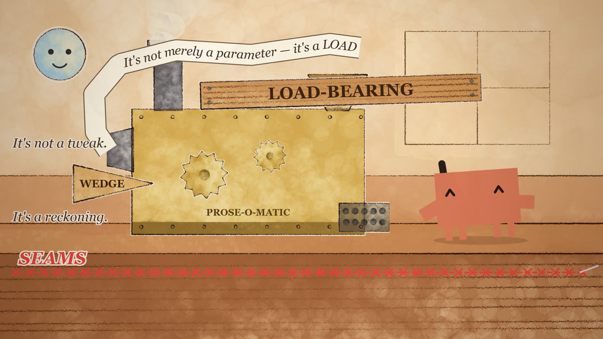

# Clawd: Mannered Prose — a musical cartoon made only with code

A 15-second cartoon that stars Clawd, the Claude Code mascot. Claude Opus 5.5 wrote all of it in code: a p5.js + p5.brush watercolor picture, a synthesized score and sound effects, and a Puppeteer + FFmpeg render. The project uses no animation program, no video editor and no stock audio.

[](https://az9713.github.io/opus-5.5-musical-cartoon/)

**▶ [Play the video (GitHub Pages)](https://az9713.github.io/opus-5.5-musical-cartoon/)** · [direct MP4](https://az9713.github.io/opus-5.5-musical-cartoon/clawd-prose/out/clawd-prose.mp4) · [MP4 in repo](clawd-prose/out/clawd-prose.mp4)

## Live pages (GitHub Pages)

| Page | Link |
|---|---|
| Video player + prompts + storyboard | https://az9713.github.io/opus-5.5-musical-cartoon/ |
| Development journey | https://az9713.github.io/opus-5.5-musical-cartoon/DEVELOPMENT-JOURNEY.html |
| Implementation plan | https://az9713.github.io/opus-5.5-musical-cartoon/implementation-plan.html |

## How the prompt becomes an MP4: the tool chain

No AI model makes a pixel or a sound in this project. The model writes programs. The programs draw 360 still pictures and calculate the sound as numbers. FFmpeg joins the pictures and the sound into a video. Each step below receives a file, does one job, and hands a file to the next step.

**The short version:** prompt → Claude Code (Opus 5.5) writes the code → Node.js runs it → headless Chrome runs the scene with p5.js + p5.brush → Puppeteer saves 360 PNG frames → `score.mjs` calculates `score.wav` → FFmpeg joins frames + WAV into the MP4 → ffprobe measures it → the model looks at sample frames and fixes the code.

| # | Tool | What it is | What it receives | What it does in this build | What it hands on |
|---|---|---|---|---|---|
| 1 | **Your prompt** (`my_prompts.txt`, `my_storyboard.txt`) | Plain text | — | Sets the story, the 5 beats with fixed times, and the rules: 15 s, 1920×1080, 24 fps, p5.js + p5.brush, music and sound made in code | The brief |
| 2 | **Claude Code** v2.1.281 (the harness) | The agent program that runs in the terminal. It gives the model tools. | The brief | Gives the model 3 abilities: write and edit files, run shell commands (`node`, `ffmpeg`), and open PNG/JPG files as images. Without the harness, the model can only write text. | Files on disk, command output, images for the model |
| 3 | **Claude Opus 5.5** (the model) | The large language model that does the thinking | The brief, command output, images of frames | Plans the film, writes every line of code (`scene.js`, `clawd.js`, `paint.js`, `score.mjs`, `render.mjs`, `cues.json`), runs the render, then reads sample frames as images, finds errors, and changes the code. It cannot hear audio, so it checks the sound as numbers and as a waveform picture. | Source code |
| 4 | **Advisor** (Fable 5.1) | A second model that reads the whole session and gives advice | The session transcript | 2 calls in the build session: one after the pipeline proof (paint on paper colour, scale brushes up, check that renders are identical), one before "done" (read the final contact sheet, fix a lean jump at 12.083 s). It writes no code. | Advice to Opus 5.5 |
| 5 | **Python** 3.13.5 | A scripting language | — | Preflight only: searched the Claude Code program file for the terminal logo, which is the reference for Clawd's shape. It is not part of the video pipeline. | Clawd reference |
| 6 | **Node.js** v22.22.0 | Runs JavaScript outside a browser | `render.mjs`, `score.mjs` | Runs the 2 control programs: `render.mjs` (starts Chrome, captures frames, calls FFmpeg) and `score.mjs` (calculates the sound) | Running processes |
| 7 | **npm** | The package installer for Node | `package.json` | Installs 3 packages into `node_modules/`: p5 2.2.3, p5.brush 2.2.3, puppeteer-core 25.12.0 | Libraries |
| 8 | **Node `http`** (built in) | About 10 lines of web server | The project folder | Serves the folder at `http://localhost:8765`, because Chrome blocks `cues.json` and fonts that open from a `file://` path | The page, to Chrome |
| 9 | **Google Chrome, headless** | The browser with no window | `index.html` + the scripts | Runs the scene code. It draws on the GPU through ANGLE and Direct3D 11 (`--use-angle=d3d11 --enable-webgl --ignore-gpu-blocklist`). | A drawn canvas |
| 10 | **p5.js** 2.2.3 | A JavaScript drawing library for "creative coding" | Calls from `paint.js` | Gives p5.brush a WebGL canvas (a drawing surface on the GPU) to paint on. The normal p5 `draw()` loop is not used for the video, because it runs on the real clock. | A WebGL canvas |
| 11 | **p5.brush** 2.2.3 (uses simplex-noise) | A p5.js add-on that imitates watercolor, pens and pencils | Shapes and colours from `paint.js` | Paints the 23 sprites (paper, wall, desk, laptop, prose machine, vacuum, card, Clawd's pigment texture) **one time** at the start, each with a fixed seed. If it painted again in each frame, the edges would move ("boil") and the render would be too slow. | 23 painted images |
| 12 | **Canvas 2D API** (built into Chrome) | The browser's normal 2D drawing surface | The 23 sprites + the time `t` | `renderFrame(i)` in `scene.js` draws frame *i* as a function of `t = i/24` only. It places, turns, stretches and squashes the sprites, draws Clawd from its pixel grid (`clawd.js`), and draws all text. | One finished frame on the canvas |
| 13 | **`cues.json`** | A list of cue times in seconds | — | The single timing source. `scene.js` and `score.mjs` both read it, so a picture event and its sound stay on the same frame. | Cue times |
| 14 | **puppeteer-core** 24.43.1 | A Node library that controls Chrome from a script | Chrome | Opens the page and waits until the sprites are painted. Then for frames 0–359 it calls `renderFrame(i)` and saves a PNG screenshot of the canvas. "-core" uses your installed Chrome, so it does not download its own copy. | 360 PNG files (one for each 1/24 s) |
| 15 | **`score.mjs`** (Node, no library) | A synthesizer written in code | `cues.json` | Calculates 720,000 numbers (48 kHz × 15 s, mono): music box, tuba, harpsichord, choir, siren, vacuum and about 30 sound effects, made from sine, saw, square, triangle and noise waves. 1 video frame = 2,000 samples. | Numbers in memory |
| 16 | **WAV format** | The simplest audio file: a 44-byte header and a list of 16-bit numbers | The numbers | `score.mjs` writes the header and the samples itself | `out/score.wav` |
| 17 | **FFmpeg** 7.1.1 | A command-line program that reads and writes video and audio | 360 PNGs + `score.wav` | (1) Joins the PNGs into H.264 video (`libx264 -crf 16 -preset slow -pix_fmt yuv420p`, bt709 colour tags, `+faststart`). (2) Adds the WAV as AAC audio at 192 kb/s and cuts both to exactly 15 s. (3) For the checks: contact sheets, tiled stills, a waveform picture and loudness numbers. | `out/clawd-prose.mp4` + check images |
| 18 | **ffprobe** 7.1.1 | FFmpeg's measuring tool | The MP4 | Counts the frames and measures the duration, size and codecs: 360 frames, 15.000 s, 1920×1080, 24 fps | Numbers for the model |
| 19 | **The check loop** (Opus 5.5 + FFmpeg + ffprobe) | Steps 3, 17 and 18 again | Stills, sheets, numbers | The model opens the contact sheet and stills as images, finds errors (for example reversed ribbon letters, a label off screen), changes the code, and renders again. Most of the build time went into this loop. | The final MP4 |

**After the MP4** (publishing only, not part of the picture or the sound): git, the GitHub CLI `gh`, and GitHub Pages put the code, the video and the docs online.

**Not used:** Pixabay (its API has no music or sound endpoint), Higgsfield, any AI image, video or audio generator, any animation program, any video editor, any stock audio.

**More detail:** [plan §2 "The tools"](https://az9713.github.io/opus-5.5-musical-cartoon/implementation-plan.html), §3 "What p5.js is, and what p5.brush adds", §4 "How a video is made from frames" · [journey §2 "The whole process on one page"](https://az9713.github.io/opus-5.5-musical-cartoon/DEVELOPMENT-JOURNEY.html), §11 "How the music and sound are made", §15 "Tools used"

## Inspiration and credit

This project is inspired by the Code Bear YouTube video **[“I Asked Claude OPUS 5.5 to Make a Cartoon From Scratch… and It Did!”](https://www.youtube.com/watch?v=dT8OM3cqrMo)** ([repo: aadil6971/clawd-video](https://github.com/aadil6971/clawd-video)).

- **The prompts are borrowed from Code Bear.** The prompt frame (15-second Clawd video, p5.js + p5.brush, warm watercolor, playful cartoon movement, and the follow-up for SFX and background music) comes from that video.
- **The storyboard is our own.** Code Bear's storyboard has Clawd peek out, type, catch a bug under a cup, and dance. Our storyboard, “Mannered Prose”, is a new story: Clawd turns “Change the parameter.” into a Victorian prose machine, and Anthropic vacuums the prose away.
- **The code is our own.** The engine was written from scratch. The Code Bear repo was used as reference only; no code was copied.

## Prompts and storyboard

<details>
<summary><b>my_prompts.txt</b> — prompt frame borrowed from Code Bear (click to open)</summary>

```text
>Create a 15-second animated video starring the Claude Code mascot, Clawd—the small orange pixel-style character. Use an accurate reference for its appearance.

Build it from scratch using p5.js and p5.brush, with a warm watercolor background and playful cartoon movement.

Storyboard:
0–3s: The innocent question

Clawd sits at the laptop. A tiny user prompt appears:

“Explain this simply.”

Clawd immediately types:

“Change the parameter.”

He freezes.

Horrified.

That was far too clear.

Clawd slowly deletes it, straightens an imaginary bow tie, cracks his fingers, and activates a large brass switch labeled:

PROSE

3–7s: The Mannered Prose Machine awakens

The laptop transforms into an absurd Victorian prose factory.

Clawd feeds the tiny sentence:

“Change the parameter.”

into one end.

The machine starts shaking violently and spits out an enormous ribbon of text:

“It’s not merely a parameter — it’s a LOAD-BEARING dial worth turning...”

Then the metaphors become physical objects:

LOAD-BEARING arrives as a giant structural beam.
SEAMS stitch themselves across the screen.
A literal WEDGE gets hammered between two sentences.
Huge em dashes fly around like boomerangs.
A tiny word “QUIETLY” tiptoes past.
Three identical bullet points reproduce for no apparent reason.

Clawd types faster and faster, delighted with himself.

7–10s: Concision makes everything worse

The prose has now completely buried the laptop.

The user sends another tiny message:

“Can you be concise?”

Clawd confidently slams a red button labeled:

CONCISE

The gigantic paragraph is instantly compressed...

...into an impossibly dense smaller paragraph containing exactly the same amount of prose.

Clawd proudly stamps the end:

“AND THAT MATTERS.”

The user's tiny avatar puts on reading glasses.

Then stronger reading glasses.

Then a magnifying glass.

10–13s: Anthropic intervenes

A huge system-message card descends dramatically from heaven:

PLEASE REMOVE ALL MANNERED PROSE.

Alarm sirens.

Clawd panics.

A giant vacuum sucks away:

LOAD-BEARING!
THE REAL UNLOCK!
SEAMS!
WEDGE!
QUIETLY!
the em dashes, metaphors, flourishes, dramatic pauses, and unnecessary third bullet point.

Everything disappears.

One tiny sentence remains on the laptop:

“Change the parameter.”

Silence.

Clawd stares at it in existential disbelief.

13–15s: Recovery… almost

Clawd reluctantly presses SEND.

The user immediately gives a green thumbs-up.

Clawd looks astonished.

Then pleased.

He turns toward the camera, raises one finger, and begins typing:

“The real lesson isn’t brevity. It’s—”

Before he can finish, the giant REMOVE MANNERED PROSE vacuum reappears and sucks Clawd offscreen.

Laptop remains.

Final text:

“Be direct.”

Cut to black.


> you also have access to pixabay api.
the key is in the env make  use of it
and sfx and bkgnd music to this video


```
</details>

<details>
<summary><b>my_storyboard.txt</b> — our own storyboard (click to open)</summary>

```text
0–3s: The innocent question

Clawd sits at the laptop. A tiny user prompt appears:

“Explain this simply.”

Clawd immediately types:

“Change the parameter.”

He freezes.

Horrified.

That was far too clear.

Clawd slowly deletes it, straightens an imaginary bow tie, cracks his fingers, and activates a large brass switch labeled:

PROSE

3–7s: The Mannered Prose Machine awakens

The laptop transforms into an absurd Victorian prose factory.

Clawd feeds the tiny sentence:

“Change the parameter.”

into one end.

The machine starts shaking violently and spits out an enormous ribbon of text:

“It’s not merely a parameter — it’s a LOAD-BEARING dial worth turning...”

Then the metaphors become physical objects:

LOAD-BEARING arrives as a giant structural beam.
SEAMS stitch themselves across the screen.
A literal WEDGE gets hammered between two sentences.
Huge em dashes fly around like boomerangs.
A tiny word “QUIETLY” tiptoes past.
Three identical bullet points reproduce for no apparent reason.

Clawd types faster and faster, delighted with himself.

7–10s: Concision makes everything worse

The prose has now completely buried the laptop.

The user sends another tiny message:

“Can you be concise?”

Clawd confidently slams a red button labeled:

CONCISE

The gigantic paragraph is instantly compressed...

...into an impossibly dense smaller paragraph containing exactly the same amount of prose.

Clawd proudly stamps the end:

“AND THAT MATTERS.”

The user's tiny avatar puts on reading glasses.

Then stronger reading glasses.

Then a magnifying glass.

10–13s: Anthropic intervenes

A huge system-message card descends dramatically from heaven:

PLEASE REMOVE ALL MANNERED PROSE.

Alarm sirens.

Clawd panics.

A giant vacuum sucks away:

LOAD-BEARING!
THE REAL UNLOCK!
SEAMS!
WEDGE!
QUIETLY!
the em dashes, metaphors, flourishes, dramatic pauses, and unnecessary third bullet point.

Everything disappears.

One tiny sentence remains on the laptop:

“Change the parameter.”

Silence.

Clawd stares at it in existential disbelief.

13–15s: Recovery… almost

Clawd reluctantly presses SEND.

The user immediately gives a green thumbs-up.

Clawd looks astonished.

Then pleased.

He turns toward the camera, raises one finger, and begins typing:

“The real lesson isn’t brevity. It’s—”

Before he can finish, the giant REMOVE MANNERED PROSE vacuum reappears and sucks Clawd offscreen.

Laptop remains.

Final text:

“Be direct.”

Cut to black.
```
</details>

## Run it

```
cd clawd-prose
npm install
node score.mjs    # synthesizes out/score.wav
node render.mjs   # renders 360 frames and encodes out/clawd-prose.mp4 (about 6 min)
```

Output: 1920×1080, 24 fps, 360 frames, 15.000 s, H.264 + AAC. Requirements, check tools and the file map are in [`clawd-prose/README.md`](clawd-prose/README.md).

## Repository map

| Path | What it is |
|---|---|
| `clawd-prose/` | Runnable source: `scene.js`, `clawd.js`, `paint.js`, `score.mjs`, `render.mjs`, `cues.json` |
| `clawd-prose/out/` | The MP4, the WAV score, and check images (contact sheet, sprites, poses, waveform) |
| `DEVELOPMENT-JOURNEY.html` + `journey/` | How the video was built, with stills |
| `implementation-plan.html` | The full spec: shot list, score cues, pitfalls |
| `my_prompts.txt`, `my_storyboard.txt` | The prompts and the storyboard |
| `index.html` | The GitHub Pages landing page |
